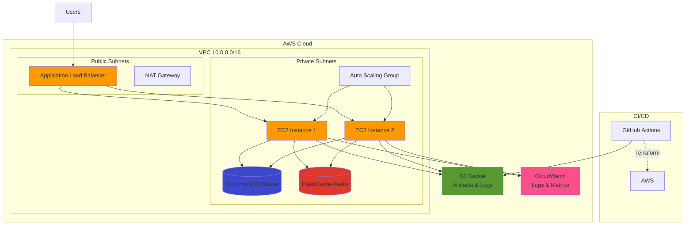

# Production AWS Infrastructure Automation

[](https://www.terraform.io/)
[](https://aws.amazon.com/)
[](https://github.com/features/actions)

A production-ready AWS infrastructure automation project demonstrating DevOps best practices with Terraform, CI/CD pipelines, and automated deployments for a Learning Management System (LMS).

## 🎯 Project Overview

This project implements a complete production-style AWS environment with:

- **Infrastructure as Code**: Terraform modules for VPC, EC2, RDS (DocumentDB), ElastiCache (Redis), S3, ALB, IAM, and CloudWatch
- **Multi-Environment**: Separate configurations for `dev` and `prod` environments
- **Remote State Management**: S3 backend with DynamoDB state locking
- **CI/CD Pipeline**: GitHub Actions workflow with automated validation, planning, and deployment
- **Automated Deployment**: Application deployment via user-data scripts and CloudWatch monitoring
- **Security**: Encryption at rest, IAM roles, security groups, and private subnets

## 📋 Table of Contents

- [Architecture](#-architecture)
- [Prerequisites](#-prerequisites)
- [Quick Start](#-quick-start)
- [Project Structure](#-project-structure)
- [Deployment Guide](#-deployment-guide)
- [CI/CD Pipeline](#-cicd-pipeline)
- [Monitoring](#-monitoring)
- [Cost Estimation](#-cost-estimation)
- [Troubleshooting](#-troubleshooting)

## 🏗️ Architecture



### Key Components

- **VPC**: Isolated network with public and private subnets across multiple AZs
- **ALB**: Application Load Balancer distributing traffic to EC2 instances
- **EC2**: Auto Scaling Group with instances running Node.js backend and Next.js frontend
- **DocumentDB**: MongoDB-compatible database cluster
- **ElastiCache**: Redis cluster for caching and session management
- **S3**: Storage for application artifacts, logs, and Terraform state
- **CloudWatch**: Centralized logging and monitoring with custom metrics and alarms
- **IAM**: Least-privilege roles for EC2 instances

## ✅ Prerequisites

### Required Tools

- [Terraform](https://www.terraform.io/downloads) >= 1.0
- [AWS CLI](https://aws.amazon.com/cli/) configured with credentials
- [Git](https://git-scm.com/)
- AWS Account with appropriate permissions

### AWS Permissions Required

- VPC, EC2, RDS, ElastiCache, S3, IAM, CloudWatch full access
- DynamoDB (for state locking)

### Before You Begin

1. **Create EC2 Key Pair**: Create a key pair in AWS Console for SSH access
2. **Choose AWS Region**: Default is `us-east-1`, update if needed
3. **Unique S3 Bucket Names**: Update `bucket_suffix` in `terraform.tfvars` (must be globally unique)
4. **Database Credentials**: Change default passwords in `terraform.tfvars`

## 🚀 Quick Start

### 1. Clone the Repository

```bash
git clone <repository-url>
cd AWS-production
```

### 2. Set Up Remote State Backend

```bash
cd terraform/backend-setup
terraform init
terraform apply
```

Note the outputs - you'll need these for the next step.

### 3. Deploy Dev Environment

```bash
cd ../environments/dev

# Update terraform.tfvars with your values
# - bucket_suffix (must be unique)
# - key_name (your EC2 key pair)
# - db_password (secure password)

terraform init
terraform plan
terraform apply
```

### 4. Access Your Application

After deployment completes (5-10 minutes):

```bash
terraform output application_url
```

Visit the URL in your browser!

## 📁 Project Structure

```
AWS-production/
├── .github/
│   └── workflows/
│       └── terraform-ci.yml          # CI/CD pipeline
├── LMS/                               # Application code
│   ├── Backend/                       # Node.js API
│   └── frontend/                      # Next.js frontend
├── scripts/
│   ├── deploy.sh                      # Application deployment script
│   └── cloudwatch-config.json         # CloudWatch agent config
└── terraform/
    ├── backend-setup/                 # Remote state infrastructure
    │   ├── main.tf
    │   ├── variables.tf
    │   └── outputs.tf
    ├── modules/                       # Reusable Terraform modules
    │   ├── alb/                       # Application Load Balancer
    │   ├── cloudwatch/                # Logging and monitoring
    │   ├── ec2/                       # Compute instances
    │   ├── elasticache/               # Redis cluster
    │   ├── iam/                       # IAM roles and policies
    │   ├── rds/                       # DocumentDB cluster
    │   ├── s3/                        # S3 buckets
    │   ├── security-groups/           # Security groups
    │   └── vpc/                       # Network infrastructure
    └── environments/
        ├── dev/                       # Development environment
        │   ├── main.tf
        │   ├── variables.tf
        │   ├── terraform.tfvars
        │   └── outputs.tf
        └── prod/                      # Production environment
            ├── main.tf
            ├── variables.tf
            ├── terraform.tfvars
            └── outputs.tf
```

## 📖 Deployment Guide

See [DEPLOYMENT.md](DEPLOYMENT.md) for detailed deployment instructions including:

- Initial infrastructure setup
- Application deployment process
- Environment promotion (dev → prod)
- Rollback procedures
- Updating infrastructure

## 🔄 CI/CD Pipeline

The GitHub Actions workflow automates the entire deployment process:

### Pipeline Stages

1. **Validate** (on PR): Runs `terraform fmt`, `init`, and `validate`
2. **Plan** (on PR): Generates execution plan and posts to PR comments
3. **Apply** (on merge to main): Deploys infrastructure with manual approval gates

### Manual Approval

Production deployments require manual approval via GitHub Environments:

1. Navigate to **Settings** → **Environments**
2. Create `dev` and `prod` environments
3. Add required reviewers for `prod`

### GitHub Secrets Required

Add these secrets in **Settings** → **Secrets and variables** → **Actions**:

- `AWS_ACCESS_KEY_ID`
- `AWS_SECRET_ACCESS_KEY`

### Triggering Deployments

```bash
# Automatic on PR merge
git checkout main
git merge feature-branch
git push origin main

# Manual trigger
# Go to Actions → Terraform CI/CD → Run workflow
```

## 📊 Monitoring

### CloudWatch Dashboards

Access CloudWatch in AWS Console to view:

- **Application Logs**: Backend, frontend, and system logs
- **Metrics**: CPU, memory, disk, network, and custom application metrics
- **Alarms**: Configured for high CPU, memory, disk usage, and error rates

### Log Groups

- `/aws/ec2/{env}/lms/backend` - Backend API logs
- `/aws/ec2/{env}/lms/frontend` - Frontend application logs
- `/aws/ec2/{env}/lms/system` - System logs
- `/aws/ec2/{env}/lms/application` - General application logs

### Accessing Logs

```bash
# View recent logs
aws logs tail /aws/ec2/dev/lms/backend --follow

# Search logs
aws logs filter-log-events \
  --log-group-name /aws/ec2/dev/lms/backend \
  --filter-pattern "ERROR"
```

## 💰 Cost Estimation

### Dev Environment (~$150-200/month)

- EC2 (t3.small): ~$15/month
- NAT Gateway: ~$32/month
- ALB: ~$16/month
- DocumentDB (db.t3.medium, 1 instance): ~$60/month
- ElastiCache (cache.t3.micro): ~$12/month
- S3, CloudWatch, Data Transfer: ~$20/month

### Prod Environment (~$600-800/month)

- EC2 (t3.medium x2): ~$60/month
- NAT Gateway (3 AZs): ~$96/month
- ALB: ~$16/month
- DocumentDB (db.r5.large x3): ~$450/month
- ElastiCache (cache.r5.large x3): ~$300/month
- S3, CloudWatch, Data Transfer: ~$50/month

### Cost Optimization Tips

- Stop dev environment outside business hours
- Use Reserved Instances for prod
- Enable S3 lifecycle policies
- Review CloudWatch log retention
- Use AWS Cost Explorer for monitoring

## 🔧 Troubleshooting

### Common Issues

#### 1. Terraform State Lock

**Error**: "Error locking state"

**Solution**:
```bash
# List locks
aws dynamodb scan --table-name lms-terraform-state-locks

# Force unlock (use with caution)
terraform force-unlock <LOCK_ID>
```

#### 2. EC2 Instances Unhealthy

**Check**:
```bash
# View instance logs
aws ec2 get-console-output --instance-id <instance-id>

# Check CloudWatch logs
aws logs tail /aws/ec2/dev/lms/system --follow
```

#### 3. Application Not Accessible

**Verify**:
- ALB target health: AWS Console → EC2 → Target Groups
- Security groups allow traffic on ports 80, 443, 3001, 4000
- Check ALB DNS name: `terraform output alb_dns_name`

#### 4. Database Connection Issues

**Check**:
- Security group allows port 27017 from EC2 security group
- DocumentDB endpoint is correct in environment variables
- VPC DNS resolution is enabled

### Getting Help

1. Check CloudWatch logs for error messages
2. Review Terraform plan output
3. Verify AWS service quotas
4. Check GitHub Actions workflow logs

## 🔒 Security Best Practices

- ✅ All data encrypted at rest (S3, EBS, RDS, ElastiCache)
- ✅ IAM roles follow least-privilege principle
- ✅ Security groups restrict access to necessary ports only
- ✅ Private subnets for databases and cache
- ✅ Terraform state encrypted in S3
- ⚠️ **TODO**: Use AWS Secrets Manager for database credentials
- ⚠️ **TODO**: Enable MFA for AWS accounts
- ⚠️ **TODO**: Implement VPC Flow Logs
- ⚠️ **TODO**: Add WAF rules to ALB

## 📝 License

This project is for educational purposes.

## 🤝 Contributing

Contributions welcome! Please open an issue or PR.

---

**Built with ❤️ using Terraform and AWS**
